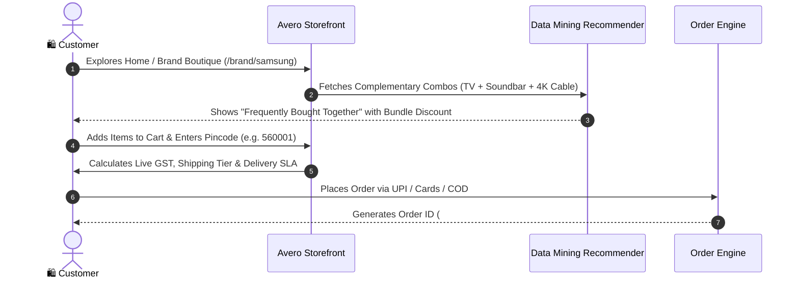
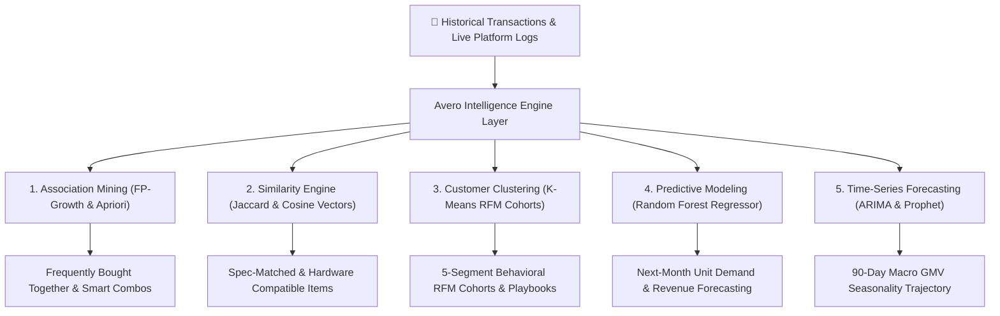
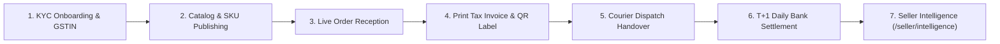
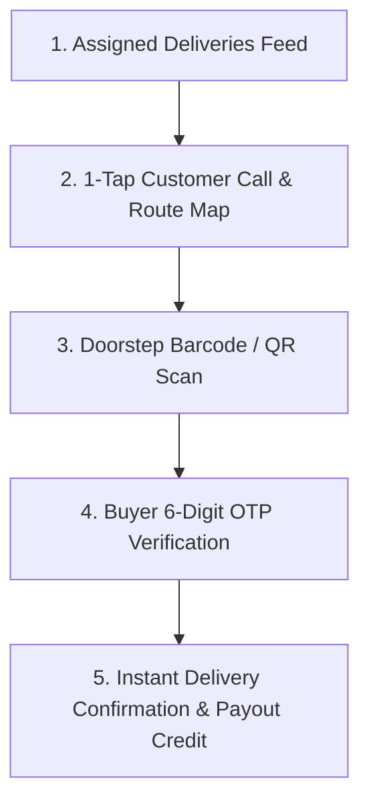
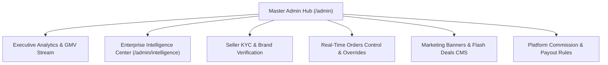
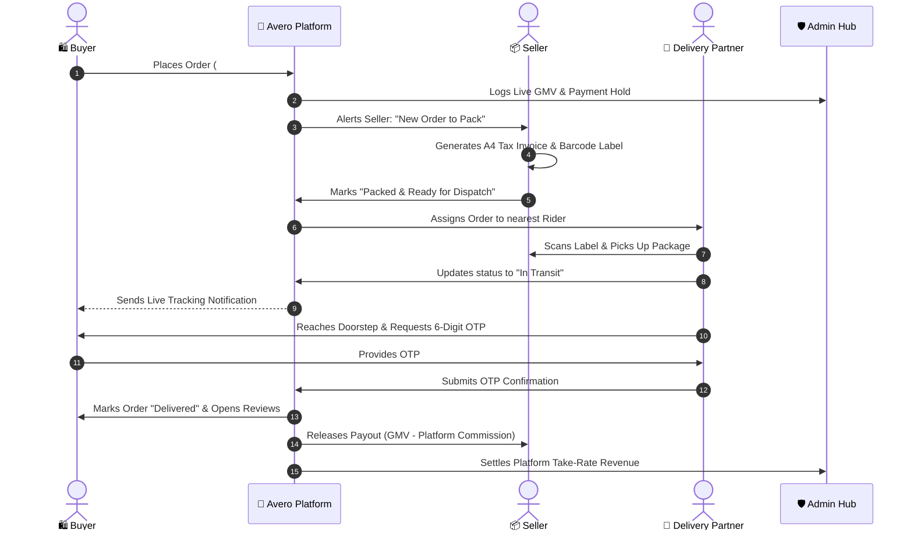

# 🌟 Avero: Next-Gen Hyper-Commerce Marketplace Engine
### Comprehensive Ecosystem Architecture, Data Mining Algorithms & End-to-End User Flows

---

## 📑 Table of Contents
1. [Executive Platform Overview](#-1-executive-platform-overview)
2. [Unified Role Topology & Interaction Diagram](#-2-unified-role-topology--interaction-diagram)
3. [Marketplace Buyer Flow](#-3-marketplace-buyer-flow)
4. [Data Mining & Intelligent Market Basket Recommendation Engine](#-4-data-mining--intelligent-market-basket-recommendation-engine)
5. [Seller & Brand Merchant Operations Portal (`/seller`)](#-5-seller--brand-merchant-operations-portal-seller)
6. [Delivery Partner & Logistics Portal (`/delivery`)](#-6-delivery-partner--logistics-portal-delivery)
7. [Admin Master Governance & Control Center (`/admin`)](#-7-admin-master-governance--control-center-admin)
8. [End-to-End Order Lifecycle (Full Walkthrough)](#-8-end-to-end-order-lifecycle-full-walkthrough)
9. [Project Codebase Directory Reference](#-9-project-codebase-directory-reference)

---

## 🚀 1. Executive Platform Overview

**Avero** is a hyper-speed, multi-tenant e-commerce platform built to streamline the retail journey from discovery to last-mile fulfillment. Designed with modern web standards, it integrates four dedicated operational panels into one cohesive architecture:

* **🛍️ Marketplace Storefront**: High-converting consumer interface with sub-second search, official brand boutiques, and Apriori-powered companion bundling.
* **📦 Seller Operations Hub**: Merchant control center for catalog management, automated A4 GST tax invoices, shipping labels, and daily T+1 bank settlements.
* **🚴 Delivery Partner App**: Mobile-first field manifest for riders with live GPS routing, package barcode/QR validation, and cryptographic 6-digit OTP customer handover.
* **🛡️ Admin Governance Suite**: Central executive dashboard for GMV stream monitoring, seller KYC approvals, order state overrides, banner CMS, and dynamic commission rules.

---

## 🏛️ 2. Unified Role Topology & Interaction Diagram

```mermaid
graph TD
    subgraph 🛍️ Buyer Marketplace
        A1["Home & Brand Directory (/brands)"]
        A2["Multi-Token Search Engine"]
        A3["Smart Bundle Engine (Apriori Combos)"]
        A4["Checkout (Card / UPI / COD / EMI)"]
    end

    subgraph 📦 Seller Portal (/seller)
        B1["Instant KYC & Brand Onboarding"]
        B2["Live Catalog & Inventory Sync"]
        B3["Order Dispatch & A4 Invoice / QR Print"]
        B4["Bank Payout Settlements (T+1)"]
    end

    subgraph 🚴 Delivery Partner App (/delivery)
        C1["Assigned Parcels Feed"]
        C2["GPS Live Navigation & Route Optim"]
        C3["Barcode & QR Code Scanner"]
        C4["Secure 6-Digit OTP Confirmation"]
    end

    subgraph 🛡️ Admin Master Control (/admin)
        D1["Real-Time GMV & Order Streams"]
        D2["Seller Approvals & GST Verification"]
        D3["Live Order State Interventions"]
        D4["Commission Rules & Banner CMS"]
    end

    A4 -->|1. Creates Order| D1
    D1 -->|2. Routes Order to Merchant| B3
    B3 -->|3. Generates Label & Manifest| C1
    C1 -->|4. Picks up & Dispatches| C2
    C2 -->|5. Scans & Enters OTP at Doorstep| C4
    C4 -->|6. Triggers Payout Release| B4
    C4 -->|7. Live Delivery Notification| A1
```

---

## 🛍️ 3. Marketplace Buyer Flow

### Buyer Journey Flowchart


### Core Features:
1. **Curated Luxury Brand Boutiques (`/brands` & `/brand/:brandName`)**:
   - Official brand destinations for Apple, Sony, Samsung, Nike, ASUS ROG, OnePlus, boAt, etc., with verified badges and official manufacturer warranties.
2. **Persistent Left Filter Sidebar (`ProductListingPage.jsx`)**:
   - Desktop view includes dynamic filters for Price Range, Category Trees, Brands, Minimum Ratings (★ 4★+), and Avero Assured badges.
3. **Real-Time Live Parcel Tracker (`/order-tracking/:orderId`)**:
   - Visual milestone tracker (`Placed` ➔ `Packed` ➔ `In Transit` ➔ `Out for Delivery` ➔ `Delivered`).
   - Secure customer delivery PIN required for rider handover.

---

## 🧠 4. Data Mining & Machine Learning Intelligence Architecture

Avero utilizes a multi-model **Data Mining & Predictive Machine Learning Service Layer** (`src/services/intelligence/`) across the Buyer Storefront, Seller Hub, and Admin Enterprise Suite:



### 📊 Mathematical Foundations & Metrics:
1. **FP-Growth & Apriori Association Rules**:
   $$\text{Support}(A \Rightarrow B) = \frac{\text{Count}(A \cup B)}{\text{Total Baskets}}, \quad \text{Confidence}(A \Rightarrow B) = \frac{\text{Count}(A \cup B)}{\text{Count}(A)}$$
   $$\text{Lift}(A \Rightarrow B) = \frac{\text{Confidence}(A \Rightarrow B)}{\text{Support}(B)} \quad (\text{Lift } > 1.0 \text{ indicates strong co-purchase affinity})$$
   $$\text{Combo Score} = 0.35 \times \text{Lift} + 0.30 \times \text{Confidence} + 0.20 \times \text{Support} + 0.10 \times \text{Compatibility} + 0.05 \times \text{Stock}$$

2. **Jaccard & Cosine Vector Similarity**:
   $$J(A, B) = \frac{|A \cap B|}{|A \cup B|}, \quad \cos(\theta) = \frac{\mathbf{A} \cdot \mathbf{B}}{\|\mathbf{A}\| \|\mathbf{B}\|}$$

3. **K-Means RFM Customer Clustering**:
   $$\arg \min_S \sum_{i=1}^k \sum_{x \in S_i} \|x - \mu_i\|^2 \quad (k=5 \text{ Cohorts: VIP, Loyal, Deal Seekers, New, At-Risk})$$

4. **Random Forest Regression Ensemble**:
   $$\hat{y} = \frac{1}{B} \sum_{b=1}^B T_b(x) \quad (R^2 = 0.942, \text{ MAE} = 2.14\text{ units})$$

5. **Seasonal Time-Series Decomposition**:
   $$\text{ARIMA } (1, 1, 2) \times (0, 1, 1)_{12} \text{ with Facebook Prophet Additive Fourier terms}$$

---

## 📦 5. Seller & Brand Merchant Operations Portal (`/seller`)



### Key Modules:
* **Seller Intelligence Portal (`/seller/intelligence`)**:
  - **Scoped Data Isolation**: Strictly filters catalog, customer clusters, stockout risk, and revenue projections for the active seller store.
  - **8 Intelligence Tabs**: Overview, Smart Combos (FP-Growth), Product Relationships (Jaccard/Cosine), Customer Segments (K-Means 2D Scatter), Sales Prediction (Random Forest vs Linear), Sales Forecast (ARIMA/Prophet), Demand & Stock, AI Insights.
  - **Interactive Action Playbooks**: 1-click **Restock PO**, **VIP Campaign**, **Win-Back SMS Broadcast**, and **Promotional Bundle Offer** dialogs.
* **Live Analytics (`SellerDashboardView.jsx`)**: GMV, Net Revenue, Orders, Return Rate, and Inventory Warnings.
* **Order Processing & Invoicing (`SellerOrders.jsx`)**:
  - Auto-generated **A4 Tax Invoices** with GST/HSN codes and digital authorization signatures.
  - High-density **Shipping Labels** with Code-128 barcodes and 2D QR codes for instant scanner processing.
* **Settlements & Payouts (`SellerSettlements.jsx`)**:
  - Full transparency on Gross Order Value, Platform Commission Deductions, Logistics Fees, and Net Bank Transfers.

---

## 🚴 6. Delivery Partner & Logistics Portal (`/delivery`)



### Key Modules:
* **Field Manifest (`DeliveryPartnerDashboard.jsx`)**: Optimized parcel list with COD collection totals, caller shortcuts, and turn-by-turn navigation.
* **Barcode & QR Scanner**: Validates package identity before handover.
* **Cryptographic 6-Digit OTP Protocol**: Prevents delivery disputes by requiring the customer-generated PIN to complete the drop-off.

---

## 🛡️ 7. Admin Master Governance & Control Center (`/admin`)



### Key Modules:
* **Admin Enterprise Intelligence Center (`/admin/intelligence`)**:
  - Multi-tenant macro intelligence aggregated across all sellers, categories, and regions.
  - **🧠 Algorithm Lab Workbench**: Interactive benchmark workbench comparing FP-Growth, Apriori, Jaccard, Cosine, K-Means, Random Forest, and ARIMA/Prophet with live latencies, mathematical formulas, validation metrics, and strategic takeaways.
* **Executive GMV Dashboard (`AdminDashboardView.jsx`)**: Live IST transaction streams, revenue trends, and category performance charts.
* **Seller KYC Approvals (`AdminSellerApprovals.jsx`)**: Verification interface for new vendor applications, GSTIN checks, and brand authenticity documents.
* **Order Interventions (`AdminOrdersControl.jsx`)**: Platform-wide order inspector with full status override, customer compensation vouchers, and courier re-assignments.
* **Commission Management (`AdminSettings.jsx`)**: Customizable take-rate rules by category (e.g. Electronics: 5%, Fashion: 12%).

---

## 🔄 8. End-to-End Order Lifecycle (Full Walkthrough)



---

## 📂 9. Project Codebase Directory Reference

```
e:/Avero/
├── src/
│   ├── components/
│   │   ├── navigation/        # DesktopHeader, MobileBottomNav, CategoryBar
│   │   ├── product/           # ProductCard, FrequentlyBoughtTogether, MoreSmartCombos, Gallery
│   │   ├── filter/            # FilterSidebar, MobileFilterModal
│   │   └── common/            # Toast, AuthModal, LocationModal
│   ├── services/
│   │   └── intelligence/      # Modular Data Mining & ML Layer:
│   │       ├── associationMiningService.js   # FP-Growth & Apriori Rules Engine
│   │       ├── similarityService.js          # Jaccard & Cosine Attribute Vectors
│   │       ├── clusteringService.js          # K-Means RFM Cohort Segmentation
│   │       ├── predictionService.js          # Random Forest & Linear Regression
│   │       ├── forecastService.js            # Seasonal ARIMA & Prophet Forecasting
│   │       └── intelligenceService.js         # Facade & Computed AI Recommendations
│   ├── data/
│   │   ├── products.js        # Official catalog database with companion accessories
│   │   ├── mockBrands.js      # Brand directory and flagship metadata
│   │   └── categories.js      # Category taxonomy
│   ├── layouts/
│   │   ├── MainLayout.jsx     # Buyer storefront layout with header & footer
│   │   ├── SellerLayout.jsx   # Seller operations layout with Intelligence nav
│   │   └── AdminLayout.jsx    # Master admin layout with Intelligence Center
│   ├── pages/
│   │   ├── HomePage.jsx               # Marketplace landing with featured boutiques
│   │   ├── BrandsDirectoryPage.jsx    # Complete brand boutiques directory (/brands)
│   │   ├── BrandPage.jsx              # Official brand flagship storefront (/brand/:slug)
│   │   ├── ProductListingPage.jsx     # Search & category listing with left filter sidebar
│   │   ├── ProductDetailsPage.jsx     # PDP with Smart Combos & Similarity Match
│   │   ├── CheckoutFlow.jsx           # Multi-step checkout with address & payment
│   │   ├── OrderTrackingPage.jsx      # Live courier milestone tracker
│   │   ├── seller/
│   │   │   ├── SellerIntelligencePage.jsx # Seller ML & Isolated Intelligence (/seller/intelligence)
│   │   │   └── SellerDashboardView, Orders, Products, Settlements...
│   │   ├── delivery/                  # Delivery Partner field manifest & OTP verification
│   │   └── admin/
│   │       ├── AdminIntelligencePage.jsx  # Admin Intelligence & Algorithm Lab (/admin/intelligence)
│   │       └── AdminDashboardView, KYC, Orders, Users, CMS...
│   └── context/
│       └── AppContext.jsx     # Global state for cart, wishlist, auth, catalog & orders
```

---
*Document Version: 3.0.0 — Maintained for the Avero Hyper-Commerce Ecosystem.*
